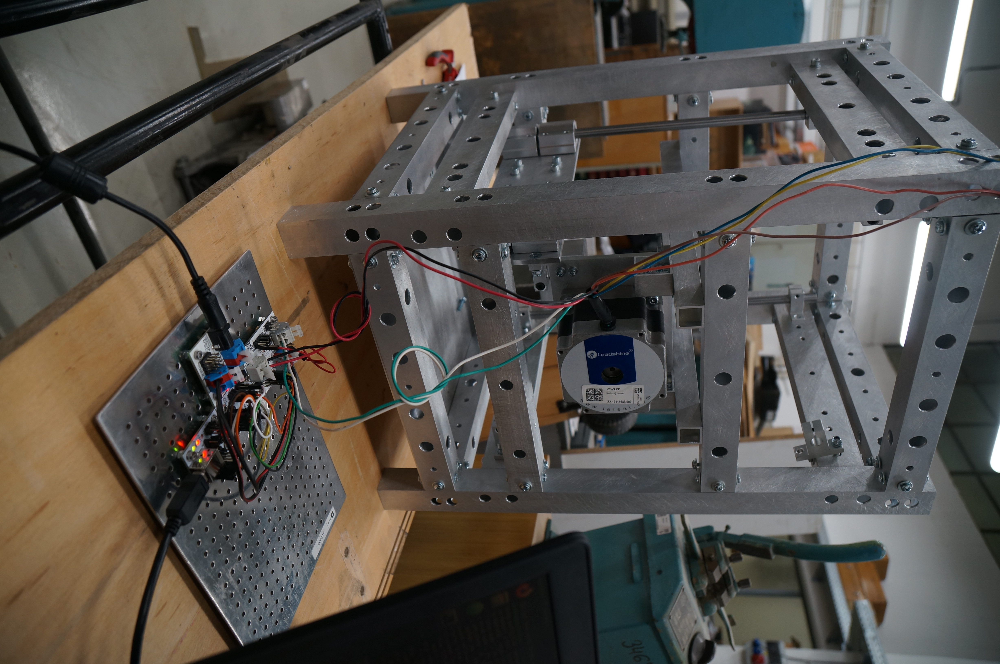

# Spark Gap control unit
The device enable precise hemisphere spark gap dimension control.





# Mlab modules
 * HBSTEP01B
 * I2CSPI01A
 * USBI2C
 * POWERSOURCE

# Dependencies
 * [PyMLAB](https://github.com/MLAB-project/pymlab) with [HIDAPI](https://github.com/trezor/cython-hidapi)
 * [Axis class](https://github.com/MLAB-project/axis)

# Configuration
Configuration is done by config [.json]() file.

```json

{
    "pymlab":{
        "i2c":{
            "device": "hid",
            "serial": "003347BC"
        },
        "bus": [
            { 
                "name":"spi", 
                "type":"i2cspi"
            },
            {
                "name": "encoder",
                "type": "rps01"
            }
        ]
    },
    "tefo":{
        "dir": 0,
        "lenght": 3300,
        "home": 1650,
        "speed": 100,
        "_lenght": 26500,
        "_home": 13250,
        "home_speed": 20 
    },
    "connection":{
        "ip": "127.0.0.1",
        "port": 5000
    }
}

```
